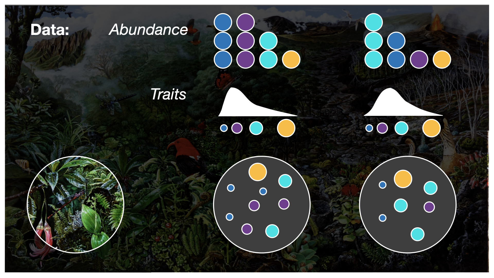

:::::::::::::::::::::::::::::::::::::: questions 

1. What do we mean by "multidimensional biodiversity data?
1. What are the four types of data we'll be covering in this workshop?
1. What types of questions can we explore with these data?
1. How will this workshop be structured? Where do I find course materials, etc?

::::::::::::::::::::::::::::::::::::::::::::::::

::::::::::::::::::::::::::::::::::::: objectives

After following this episode, participants should be able to...

1. Articulate a shared understanding of what "multidimensional biodiversity data" is
1. List the types of data to be covered in this workshop, and potential applications of MBDB
1. Locate course resources.

::::::::::::::::::::::::::::::::::::::::::::::::

## Welcome

::: instructor

Given that this curriculum deals explicitly with Indigenous data sovereignty and governance, it is advisable to start with a land acknowledgement. 

For Albuquerque, NM (the location of the first offering of this curriculum) here is info UNM's land acknowledgement and the process leading up to it:
- https://diverse.unm.edu/about-dei-at-unm/land-labor-acknowledgement.html
- https://diverse.unm.edu/assets/documents/unm-indigenous-peoples-land-and-territory-acknowledgment-brown-paper.pdf

Any land acknowledgement should be done in the context of growing awareness that the intentions of many land acknowledgements, while aspiring to be good intentions, where ill-informed and the acknowledgements have led to harm in some cases.  Here are resources to read about that:
- https://nativegov.org/news/beyond-land-acknowledgment-guide/
- https://hyperallergic.com/769024/your-land-acknowledgment-is-not-enough/
- https://www.pbs.org/newshour/nation/analysis-how-well-meaning-land-acknowledgements-can-erase-indigenous-people-and-sanitize-history

It is becoming agreed upon protocol that land acknowledgements should be given only in the context of how the event or institution presenting the land acknowledgement engages with activities beyond an otherwise hollow "acknowledgement" of unceded lands.  

:::

Welcome everyone!  This workshop will engage with ethics around biodiversity data through the lens of Indigenous data sovereignty and governance.  With that in mind, many of the locations where this workshop might run will likely be unceded Indigenous lands.  As part of our introductions we'll think about where we are, where we come from, and our positionalities.  [Native Land Digital](https://native-land.ca/) is a great resource for understanding where we are geographically, and here is a great video by Dr. Kat Gardner-Vandy and Daniella Scalice demonstrating classical academic introductions and relational introductions that center positionality:

<iframe width="560" height="315" src="https://www.youtube.com/embed/sY3LYVTTiH4?start=414&end=811" data-external= "1" allowfullscreen> </iframe>

::: instructor

A note on Native Land Digital map: the map loads with a disclaimer that is important to read: the geospatial polygons are not necessarily approved by the groups they purport to represent.  Native Land Digital is Native-led and has a mechanism to verify polygons, but there might be more accurate map representations you can use for your areas.

A note on relational intros: if giving this curriculum live you could choose to demonstrate yourselves (as instructors) the different types of introductions modeled by Dr. Kat Gardner-Vandy and Daniella Scalice, or you could show the video.  Note that it's a legit consideration about the length of the relational introduction to allow time and space for everybody to get through their introductions; more people = more succinct intros.

:::

::: challenge

Introductions! Please use this list to help guide your introduction of yourself:

* Your name
* Your pronouns
* Your positionality 
* Your institution
* Something you're excited or curious about for the workshop

:::

## Four dimensions of biodiversity data

::: discussion

* What does "multidimensional biodiversity" data mean to you?
* What types of data do you encounter in your work?
* Have you ever looked at multiple types simultaneously?

:::

In this workshop, we'll be working with four types of biodiversity data: species **abundances**, **traits**, **population genetics**, and **phylogenetics**. In this workshop, we'll cover skills for working with each data type separately, and conclude with what we can accomplish when we integrate multiple data types into the same analysis. 

To make this a little more interesting, we'll ground our learning with a "real-world" (or, close to real-world) example!

::: instructor

Transition to data narrative.

:::

For this workshop, we'll be working with some _simulated_ data based on real insect species found in the Hawaiian Islands  The data contain real taxonomic names (so we can use workflows designed for dealing with real taxonomic data) but the abundances, traits, genetics, and phylogeny are simulated using a *process model* (more on that in Part II of this workshop).

## Hawaiian sovereignty

::: instructor

Instead of "...the Indigenous land where we gather..." you could reference the specific communities.

:::

Building from our acknowledgement of the Indigenous land where we gather for this workshop, we need to acknowledge that over a century of settler research has been conducted across the Hawaiian Islands without the consent of the Kanaka Maoli, the Native Hawaiians.  The aina, or lands, of the Kanaka Maoli were stolen, their sovereignty illegally stripped, their culture, communities, and bodies killed.  Sovereignty and the return of control of *data* to Indigenous people and communities is one of the learning objectives of this workshop.  To start us on that journey, here are the words ([watch on youtube](https://youtu.be/RwWNigoZ5ro?t=89)) of Dr. Haunani-Kay Trask, a leader in the Hawaiian sovereignty movement:

> We are not Americans! We will die as Hawaiians! We will never be Americans! I am here to explain what sovereignty is. Sovereignty, as many people say, is a feeling. The other day in the paper I read sovereignty is aloha, it's love. Later on someone said it's pride. No. Sovereignty is government. Sovereignty is government! It is an attribute of nationhood. We already have aloha. We already have pride. We already know who we are. Are we sovereign? No! Because we don't have a government. Because we don't control a land base. Sovereignty is not a feeling, it is the power of government. It is political power! 

One of the contributions we as researchers can make to rematriation and repatriation of resources is to cede control of legacy biological data back to Indigenous communities, and preferably to engage in co-produced research from the beginning, where consent, governance, and mutual benefit are agreed upon before research begins.  In Episode 3: CARE and FAIR principles, we will be learning about protocols developed by [ENRICH](https://www.enrich-hub.org/) and [Local Contexts](https://localcontexts.org/) that center Indigenous data sovereignty and governance.

## More about our simulated data

::: instructor

Slide deck in [/instructors/hawaii_4_dim_data.pdf]()

:::

The Hawaiian Islands formed over a volcanic hotspot, as such Kauai is about 5 million years old, while the Big Island is still forming.

This *chronosequence* allows us to observe in the Modern (as opposed to the fossil record) what we might hypothesize to be different eco-evolutionary stages, or "snapshots," of community assembly.  We might further hypothesize that different assembly processes are more or less prevalent at different snapshots, such as increased importance of immigration early on, and greater importance of *in situ* diversification later on.

::: discussion

What data could we bring to bear on exploring these hypothesized changes in assembly processes?  

:::

**How are the four dimensions of biodiversity data conceptualized?**

::: instructor

Breakout groups or collaborate on the white board. 

:::

::: discussion

How do we express the patterns in these data
- What patterns do you see in the data?
- How could you summarize these data?

How would you expect genetic diversity, species diversity, trait, or phylogenetic diversity to vary with island age?

::::::::::::::

## Workshop logistics and preview

For the rest of the workshop, we'll take a tour of the data types and then bring them together.

### Helpful links

Course website: https://role-model.github.io/multidim-biodiv-data/

